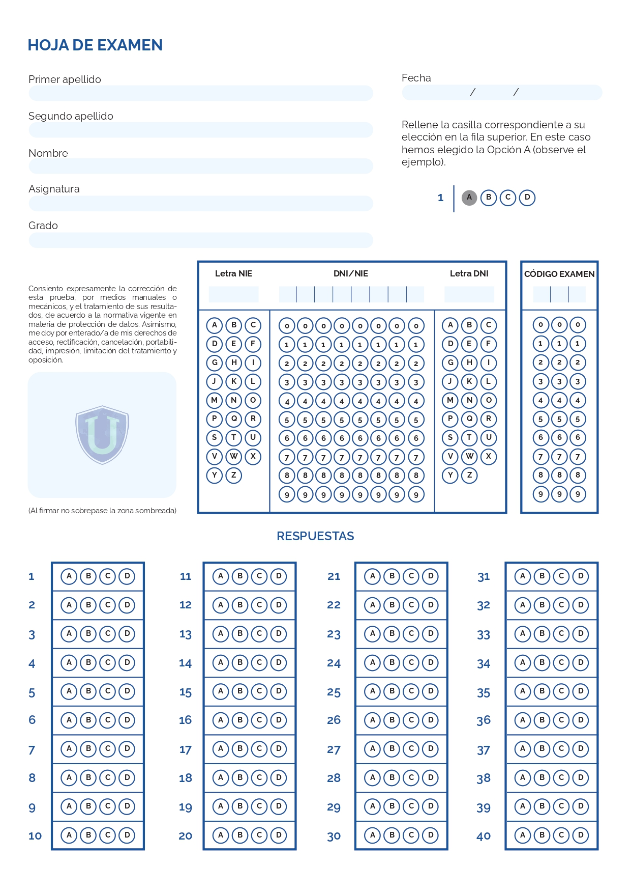
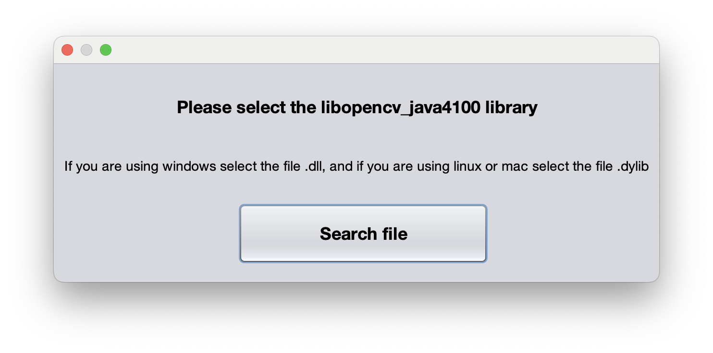
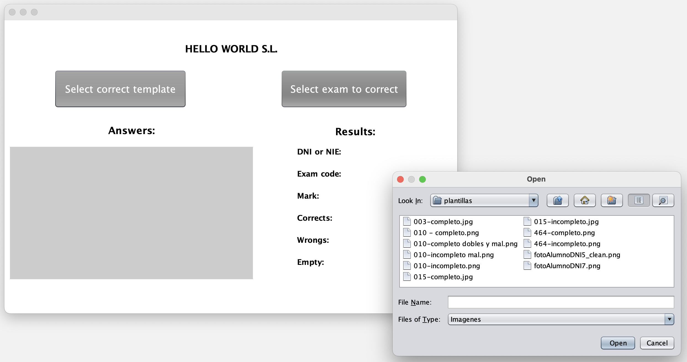
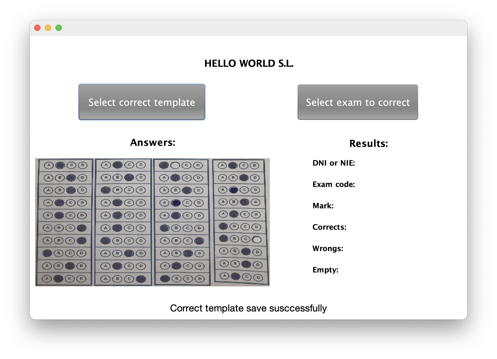
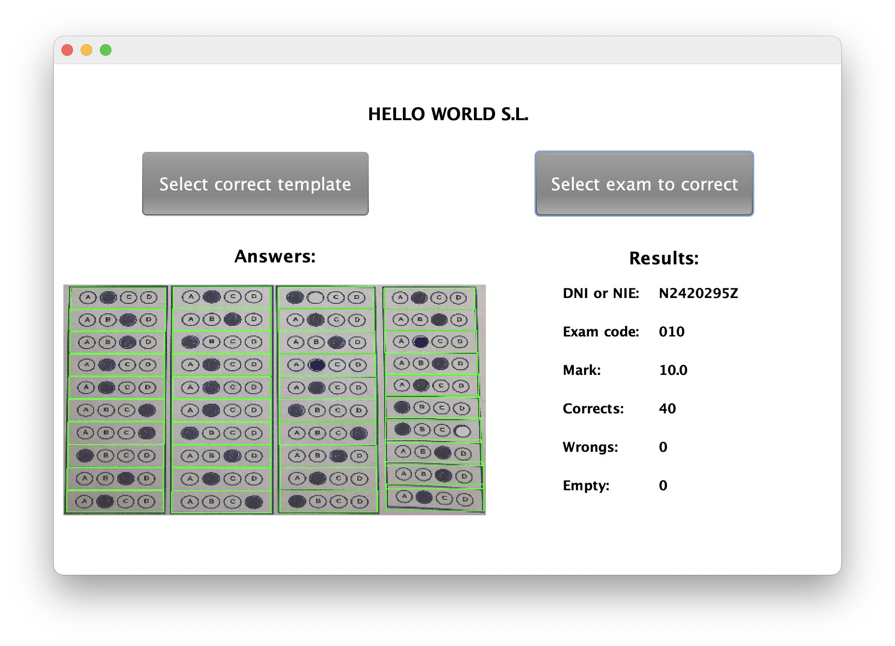
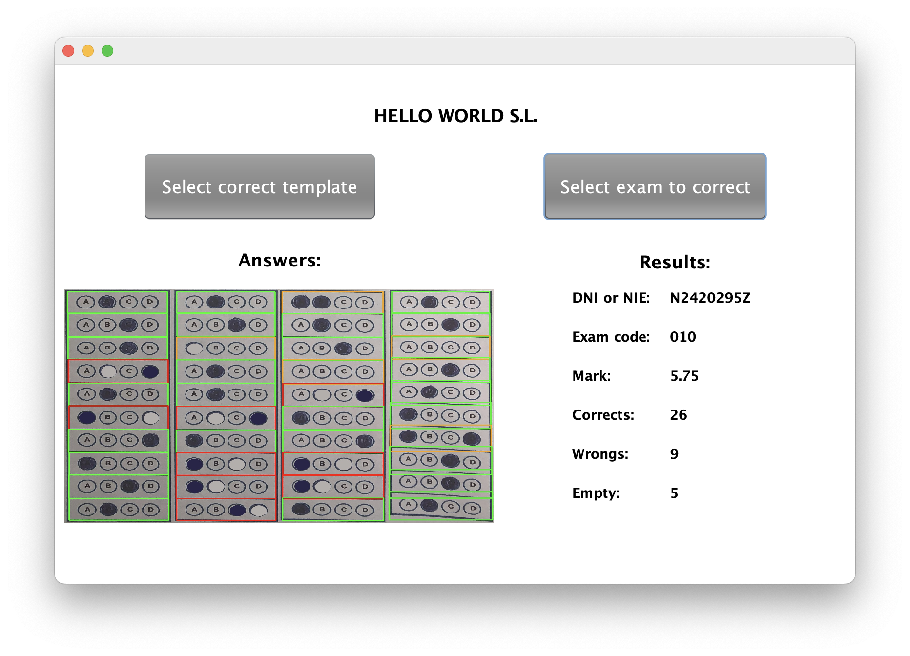

# **Exam Template Corrector**

**Descripción:**

"Exam Template Corrector" es una aplicación de escritorio desarrollada para corregir plantillas de exámenes. Con esta herramienta, podrás guardar los resultados correctos de un examen y compararlos con un modelo de examen para obtener el **DNI o NIE** del estudiante, el **código del examen**, la **calificación** y el número de respuestas **correctas**, **erróneas** y **vacías**.

---

## **Configuración de JDK y OpenCV**

Este proyecto está diseñado para trabajar con la biblioteca OpenCV y Java, pero tiene configuraciones diferentes dependiendo de la versión de **JDK** y **OpenCV** que vayas a utilizar. A continuación, se detallan las diferencias según las ramas:

---

## **Estructura de Ramas**

### **Rama `main`**
- **JDK**: Versión 23
- **OpenCV**: Versión 4.10

### **Rama `develop`**
- **JDK**: Versión 21
- **OpenCV**: Versión 4.09

---

### **Notas importantes:**
  - Necesitarás el archivo **.dylib** (macOS) o **.dll** (Windows) en tu ordenador para poder ejecutar el proyecto correctamente.
  - Ejemplo de archivos necesarios:
    - **macOS**: `libopencv_java4100.dylib`
    - **Windows**: `opencv_java410.dll`

---

### **Imágenes:**

  
<strong>Plantilla de Examen</strong>

  

  
<strong>Buscar archivo .dll o .dylib</strong>

  

  
<strong>Buscar plantilla para guardar o corregir</strong>

  

  
<strong>Plantilla correcta guardada</strong>

  

  
<strong>Exámen correcto corregido</strong>

  

  
<strong>Exámen incorrecto corregido</strong>

  

---
